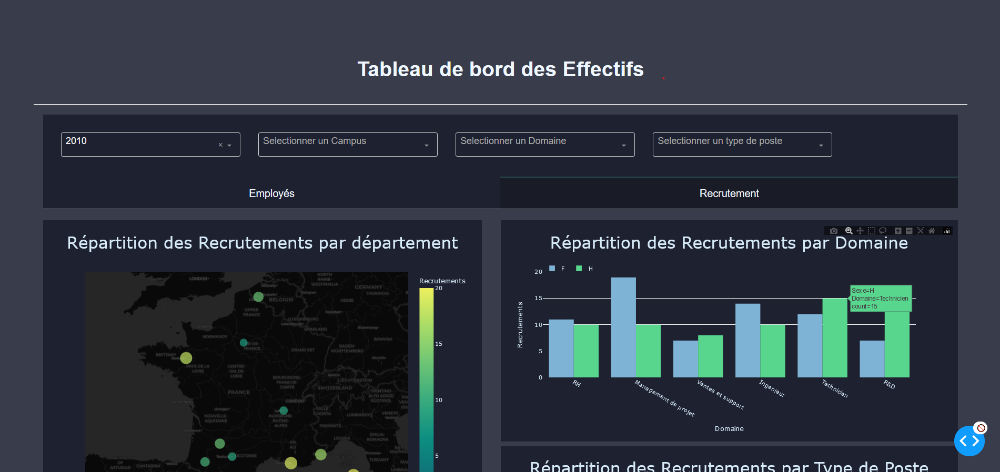
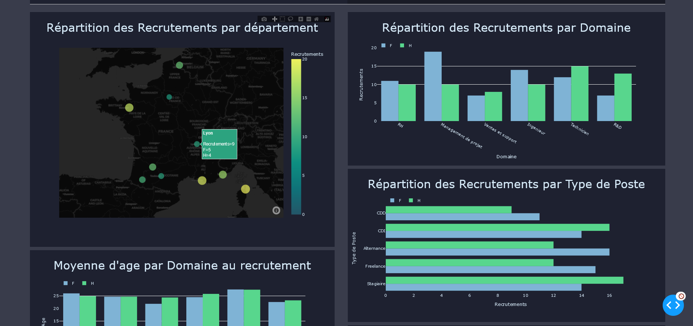
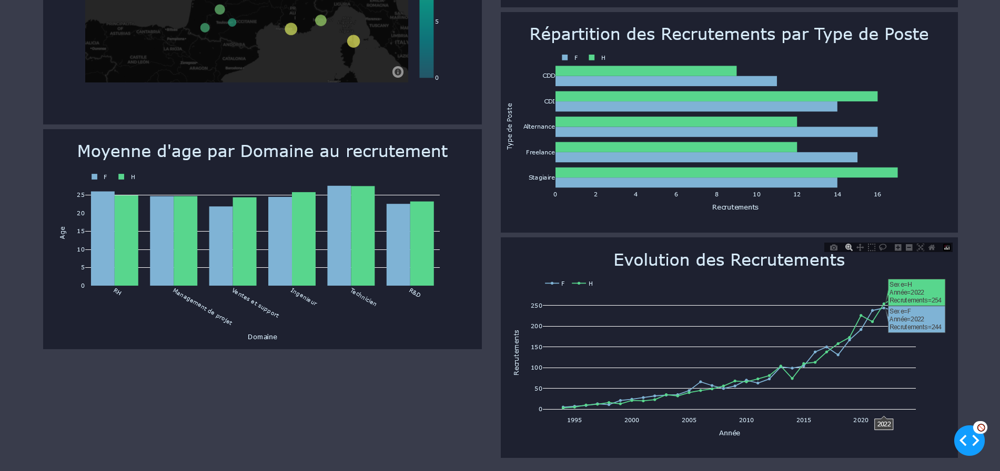

# Tableau-de-bord-des-effectifs

## Introduction

* Le `Tableau de bord des effectifs` permet de visualiser l'évolution des employées et des recrutements par sexe, campus, domaine et type de poste (ou contrat)
* ATTENTION !!! Les données utilisées sont fictives et ne représentent rien de réelles (Elles ont été générées aléatoirement).

## Screenshots





## Ressources
* Dash - framework Python de développement d'application web pour la visualisation de données
* Plotly - Librairie Python de graphes intéractifs
* Pandas - Librairie de manipulation et d'analyse des données

## Requirements

Nous vous conseillons de créer un environnement python 3 et d'installer les dépendances nécessaires. Dans un terminal de commande lancer les commandes suivantes :

```
https://github.com/Loe2b/Tableau-de-bord-des-effectifs.git
cd Tableau-de-bord-des-effectifs/
python3 -m virtualenv env
```
Sur système UNIX :

```
source venv/bin/activate
```

Sur Windows :

```
venv/Scripts/activate
```

Pour installer les les librairies et framework, lancer la commande :

```
pip install -r requirements.txt
```

## Comment utiliser l'application

Vous pouvez maintenant lancer l'application grace à la commande :

```
python app.py
```

Ouvrez http://0.0.0.0:8051/ dans votre navigateur et le tour est jouer !


